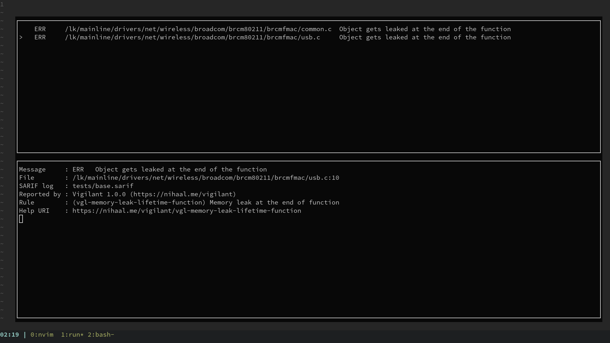

# SARIF.nvim

A Neovim plugin for viewing [SARIF](https://sarifweb.azurewebsites.net/) formatted static analysis results. 

[SARIF](https://sarifweb.azurewebsites.net/) (Static Analysis Results Interchange Format) is an open standard for making results coming from static analysis tools to be interoperable. A few static analysis tools support SARIF output, while there exists many converters that convert other static analysis tool outputs into SARIF format (eg: [SARIF Multitool](https://github.com/microsoft/sarif-sdk/blob/main/docs/multitool-usage.md#supported-converters), [ESLint](https://www.npmjs.com/package/@microsoft/eslint-formatter-sarif), [axe](https://www.npmjs.com/package/axe-sarif-converter)).

There are extensions for VSCode for loading and viewing SARIF logs : [SARIF Viewer](https://github.com/Microsoft/sarif-vscode-extension/) & [SARIF Explorer](https://github.com/trailofbits/vscode-sarif-explorer). This plugin tries to do what these extensions do, but inside Neovim.



### Features
1. Open SARIF files and list the results in a viewer
2. Classify results as True positive or False positive report, and also add comments to help during review.
3. Comments are stored in [SARIF Explorer](https://github.com/trailofbits/vscode-sarif-explorer)'s `.sarifexplorer` format ([specifications](https://github.com/trailofbits/vscode-sarif-explorer/blob/main/docs/sarif_explorer_spec.md)), and so the plugin is interoperable with SARIF explorer.

### Installation

Using [vim-plug](https://github.com/junegunn/vim-plug)

```viml
Plug 'nifey/sarif.nvim'
```

Using [dein](https://github.com/Shougo/dein.vim)

```viml
call dein#add('nifey/sarif.nvim')
```

Using [packer.nvim](https://github.com/wbthomason/packer.nvim)

```lua
use {
  'nifey/sarif.nvim'
}
```

Using [lazy.nvim](https://github.com/folke/lazy.nvim)

```lua
-- init.lua:
    {
    'nifey/sarif.nvim'
    }
```

### Usage

The plugin provides the following user commands:
- `SarifLoad` to load a SARIF file
    ```
    :SarifLoad <file.sarif>
    ```
- `SarifView` to view the loaded results
    ```
    :SarifView
- `SarifCodeFlowPrev` and `SarifCodeFlowNext` to travese the [Code Flow locations](https://github.com/microsoft/sarif-tutorials/blob/main/docs/3-Beyond-basics.md#code-flows) of the current result (if provided in the SARIF log).

For ease of viewing the results, you may want to add a keybinding for the `SarifView` command, like below:
```
vim.keymap.set("n", "fs",    "<cmd>SarifView<CR>")
vim.keymap.set("n", "<M-i>", "<cmd>SarifCodeFlowNext<CR>")
vim.keymap.set("n", "<M-o>", "<cmd>SarifCodeFlowPrev<CR>")
```

When the SarifView window is open, the top window shows a table of results, where each row displays the file name and a short message about the error. The window on the bottom shows more information about the currently selected result including the rule, the SARIF log from which it was read, and the static analysis tool that created that report. When inside the SarifView window the following key bindings can be used:
- `j` and `k` to move between the results in the results table
- `<enter>` to go to the location of the currently selected bug report
- `h` and `l` to scroll the detail view pane
- `m` to mark the status of the result (Cycles between True positive, False positive and None)
- `i` to update or insert a comment about a result
- `q` to close the viewer
- `/r` to filter the displayed results based on rule ID mentioned in the report
- `/f` to filter the displayed results based on filename mentioned in the report
- `/s` to filter the displayed results based on the marked status (True/False positive and None)
- `/c` to clear the applied filters and display all the results

### Todo
- UI improvements
    - Dynamic table resize
    - Use colors and icons
- Allow writing long-form comments rather than just a single line comment
- Handling more generic cases from SARIF Specifications
- Integrate with Nvim diagnostics to show the reports for the current file while editing
- In Code Flows, Support traversing multiple thread flows separately, and also display the state and nesting level information
